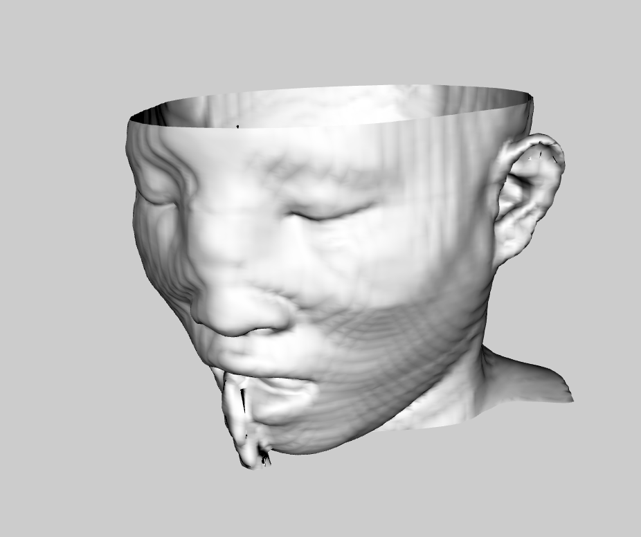
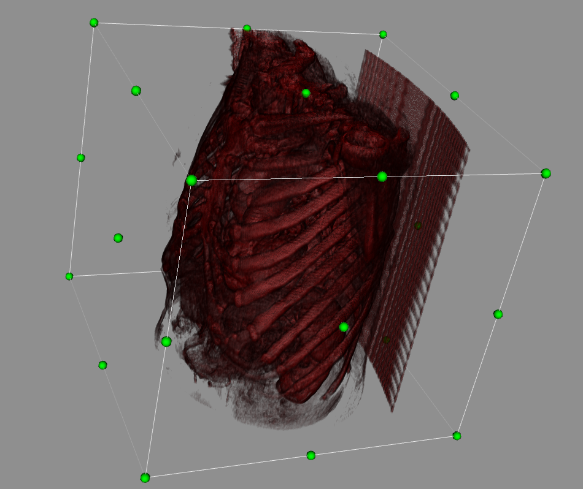
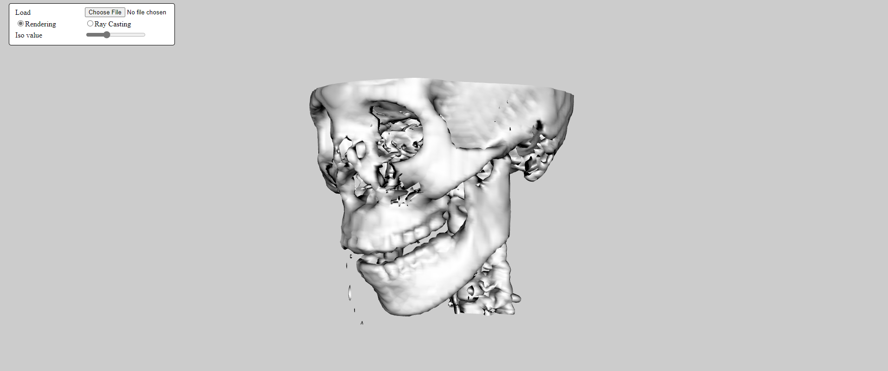
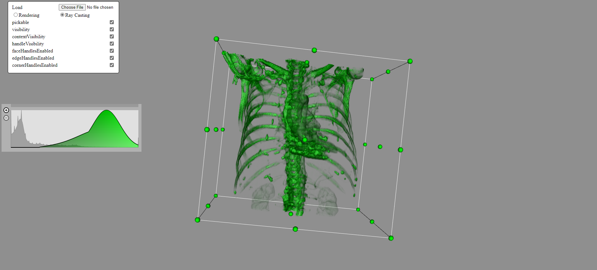
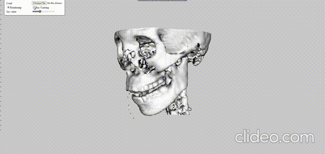

# 3D Medical Visualization

|
---
|
---

<b>A visualization VTK and JS code for surface rendering head and ray casting chest.</b>

## Installation

### Windows Users

- Download the repo.
- write `npm run install` twice.

## Implementation details

- Built volume rendering web app with VTK.js & HTML.
- Built Surface rendering with adjustable iso value.
- The user can set iso value to control the rendering<>
- Built Ray casting rendering (with a fixed transfer function).
- Added interactive widget to cut the volume in the three perpendicular planes vtkImageCroppingWidget.
- The user can set adjustable transfer function for ray casting.

## Preview (screenshots)

| |
---
 |
---
 |
---

## Issues we faced
- Make adjustable transfer function. Passed  

---

## ✨ Contributors

    
    <a href="https://github.com/MohdFarag">Mohamed Ahmed Abdullah</a>

 

    
    <a href="https://github.com/Ismail-Tawfik">Ismail Tawfik</a>

 

    
    <a href="https://github.com/Abdelrhman-Elshahed">Abdelrhman Elshahed</a>

 

    
    <a href="https://github.com/mohamedkhsaad">Mohamed Khaled</a>

---

**Thanks ..**
